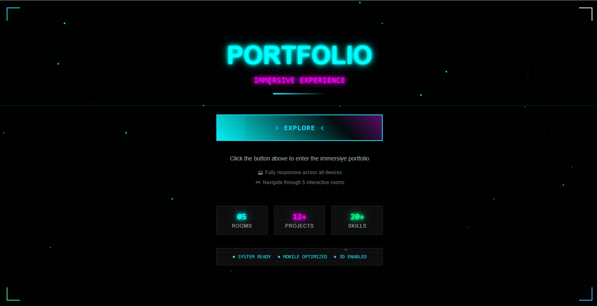

# Immersive 3D Portfolio



An immersive 3D developer portfolio built with Next.js, Three.js, and modern web technologies. Experience a unique "Don't Pluck Your Luck" themed journey through 5 interactive rooms featuring a clover mascot, 3D carousel, AI lab, and cyberpunk neon styling.

## 🌟 Live Demo

**Current Deployment:** [https://same-8oi8efsp1qn-latest.netlify.app](https://same-8oi8efsp1qn-latest.netlify.app)

## ✨ Features

### 🎮 Interactive 3D Experience
- **5 Interactive Rooms**: Hero, Skills, Projects, Contact, and AI Lab
- **3D Project Carousel**: Built with Three.js for stunning visual presentation
- **Clover Mascot**: Interactive character with animated tooltips and personality
- **Immersive Navigation**: Smooth transitions between rooms with physics-based interactions

### 🎨 Modern Design & Animations
- **Neon Cyberpunk Styling**: Complete neon glow effects and retro-futuristic UI
- **"Don't Pluck Your Luck" Theme**: Unique four-leaf clover concept throughout
- **Advanced Animations**: GSAP-powered transitions and Framer Motion components
- **Particle Effects**: Dynamic orbital animations and visual effects

### 🔐 Special Features
- **Password-Protected AI Lab**: Secret room with retro terminal interface
  - **Password**: `clover123`
  - Features AI-themed content and interactive terminal
- **Mobile-First Responsive Design**: Optimized for all devices
- **Complete Zoom Prevention**: Enhanced mobile experience with zero zoom issues

### 🛡️ Technical Excellence
- **TypeScript**: Full type safety and modern development experience
- **React Hook Compliance**: All components follow React best practices
- **Performance Optimized**: Efficient rendering and loading strategies
- **Error Boundary Protection**: Robust error handling throughout the application

## 🚀 Technology Stack

### Frontend Framework
- **Next.js 15.3.2** - React framework with App Router
- **React 18.3.1** - UI library with modern hooks
- **TypeScript** - Type-safe development

### 3D & Animation
- **Three.js 0.169.0** - 3D graphics and WebGL
- **@types/three** - TypeScript definitions for Three.js
- **GSAP 3.13.0** - Professional animation library
- **Framer Motion 12.23.7** - React animation library

### Styling & UI
- **Tailwind CSS** - Utility-first CSS framework
- **Tailwind CSS Animate** - Animation utilities
- **Class Variance Authority** - Component variant management
- **Lucide React** - Beautiful icon library
- **React Icons** - Comprehensive icon collection

### Development Tools
- **Biome** - Fast formatter and linter
- **ESLint** - Code quality and consistency
- **PostCSS** - CSS processing and optimization

### Package Management
- **Bun** - Ultra-fast JavaScript runtime and package manager

## 🛠️ Setup Instructions

### Prerequisites
- **Node.js 18+** (required)
- **Bun** (recommended) or npm/yarn
- Modern web browser with WebGL support

### Installation

1. **Clone the repository**
   ```bash
   git clone https://github.com/Cparsons0085/immersive-portfolio-3d.git
   cd immersive-portfolio-3d
   ```

2. **Install dependencies**
   ```bash
   bun install
   # or
   npm install
   ```

3. **Start development server**
   ```bash
   bun dev
   # or
   npm run dev
   ```

4. **Open in browser**
   ```
   http://localhost:3000
   ```

### Available Scripts

```bash
# Development server with Turbopack
bun dev

# Production build
bun run build

# Start production server
bun start

# Type checking and linting
bun run lint

# Code formatting
bun run format
```

## 🌐 Deployment Guide for Netlify

This project is optimized for Netlify deployment and includes a `netlify.toml` configuration file.

### Automatic Deployment from GitHub

1. **Connect to Netlify**
   - Log into [Netlify](https://netlify.com)
   - Click "New site from Git"
   - Select GitHub and authorize access
   - Choose the `Cparsons0085/immersive-portfolio-3d` repository

2. **Build Settings** (Auto-configured)
   ```
   Build command: bun run build
   Publish directory: out
   Node version: 18+
   ```

3. **Environment Variables** (if needed)
   - No environment variables required for basic deployment
   - All configurations are handled via the included `netlify.toml`

### Manual Deployment

```bash
# Build the project
bun run build

# Deploy to Netlify (requires Netlify CLI)
npx netlify deploy --prod --dir=out
```

### Production Optimizations

The project includes several production optimizations:
- **Static Export**: Configured for optimal Netlify hosting
- **Asset Optimization**: Images and resources are optimized for web
- **SEO Ready**: Meta tags and structured data included
- **Performance Monitoring**: Built-in performance tracking

## 🎯 Project Structure

```
immersive-portfolio-3d/
├── public/                     # Static assets
│   └── immersive-portfolio-3d_preview.png
├── src/
│   ├── app/                    # Next.js App Router
│   │   ├── globals.css         # Global styles
│   │   ├── layout.tsx          # Root layout
│   │   ├── page.tsx            # Home page
│   │   └── overview/           # Overview page
│   ├── components/             # React components
│   │   ├── rooms/              # Individual room components
│   │   │   ├── HeroRoom.tsx
│   │   │   ├── SkillsRoom.tsx
│   │   │   ├── ProjectsRoom.tsx
│   │   │   ├── ContactRoom.tsx
│   │   │   └── AILabRoom.tsx
│   │   ├── ImmersivePortfolio.tsx  # Main portfolio component
│   │   ├── Image3DCarousel.tsx     # 3D carousel component
│   │   ├── RoomNavigation.tsx      # Navigation system
│   │   └── ...                     # Additional components
│   └── lib/                    # Utility functions
├── netlify.toml               # Netlify configuration
├── next.config.js             # Next.js configuration
├── tailwind.config.ts         # Tailwind CSS configuration
├── tsconfig.json              # TypeScript configuration
└── package.json               # Dependencies and scripts
```

## 🎨 Room Details

### 🏠 Hero Room
- Welcome message and navigation overview
- Animated clover mascot introduction
- Interactive UI elements with neon styling

### 💡 Skills Room
- Technical skills showcase
- Interactive skill cards with animations
- Technology stack visualization

### 📂 Projects Room
- **3D Project Carousel**: Stunning Three.js implementation
- Project showcase with detailed information
- Interactive project navigation

### 📧 Contact Room
- Contact form with neon styling
- Social media links and professional profiles
- Interactive contact methods

### 🤖 AI Lab (Password Protected)
- **Password**: `clover123`
- Retro terminal interface
- AI-themed content and interactions
- Exclusive development insights

## 🔧 Configuration Files

### Next.js Configuration
- Static export enabled for Netlify
- Optimized build settings
- Image optimization configured

### Tailwind Configuration
- Custom neon color palette
- Animation utilities
- Responsive design breakpoints

### TypeScript Configuration
- Strict type checking
- Modern ES features enabled
- Path aliases configured

## 📱 Browser Support

- **Modern Browsers**: Chrome 90+, Firefox 88+, Safari 14+, Edge 90+
- **WebGL Support**: Required for 3D features
- **Mobile**: iOS 14+, Android 10+
- **Responsive**: Optimized for all screen sizes

## 🎮 Special Features

### Clover Mascot
- Interactive character with personality
- Animated tooltips and responses
- Theme-consistent design

### Password Protection
- AI Lab requires password entry
- Session-based access control
- Secure content gating

### Zoom Prevention
- Complete mobile zoom prevention
- Enhanced touch interactions
- Improved mobile experience

## 🚨 Known Issues & Solutions

### Three.js Performance
- Optimized for WebGL-capable devices
- Fallback UI for older browsers
- Performance monitoring included

### Mobile Compatibility
- Touch-first interaction design
- Responsive 3D elements
- Optimized loading strategies

## 🤝 Contributing

This is a personal portfolio project, but suggestions and feedback are welcome!

1. Fork the repository
2. Create a feature branch
3. Make your changes
4. Submit a pull request

## 📄 License

This project is open source and available under the [MIT License](LICENSE).

## 🙏 Acknowledgments

- **Three.js Community** for excellent 3D web graphics
- **Next.js Team** for the amazing React framework
- **Tailwind CSS** for utility-first styling
- **GSAP** for professional animations
- **Framer Motion** for React animations

---

**Built with ❤️ and ☘️ by Chase Parsons**

*"Don't Pluck Your Luck" - Experience the magic of modern web development*
